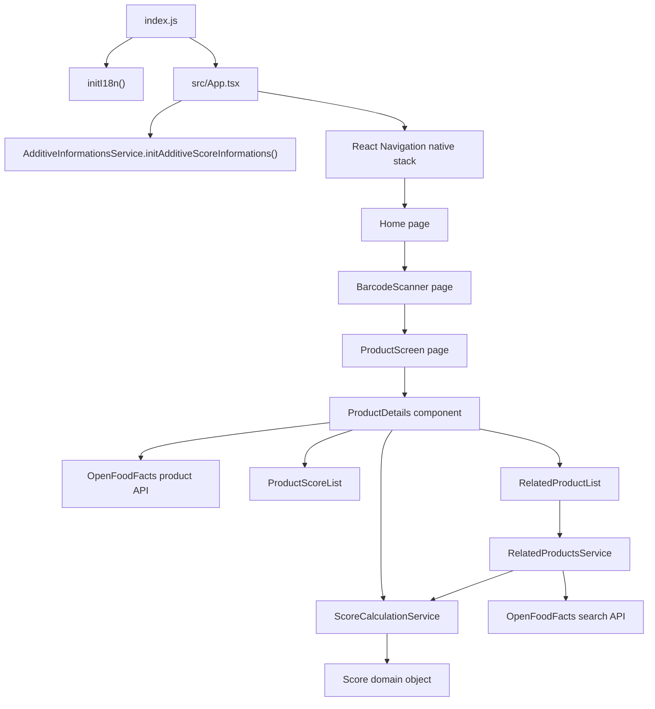
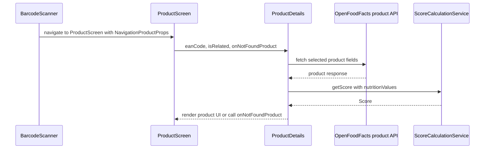
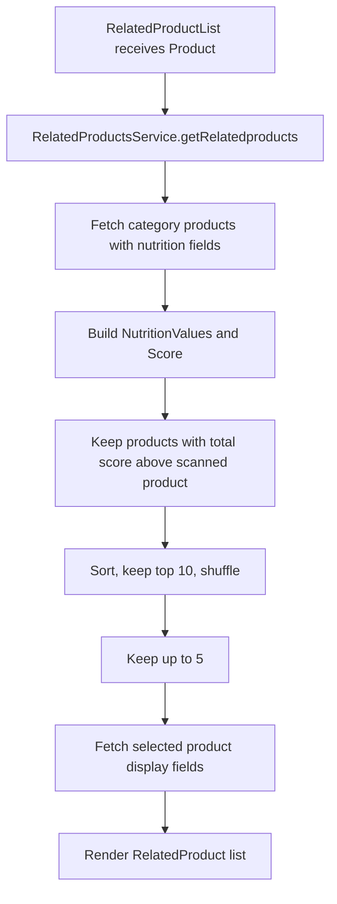

# Architecture

## System Overview

Kayu is a React Native TypeScript mobile application. The README describes it as a parody of the Yuka app, currently published only on the French Play Store. The application scans EAN-13 barcodes, fetches product data from OpenFoodFacts, calculates product scores, displays the product details, and suggests related products with better scores.

The app is organized around a small set of repeated layers:

- `src/pages`: navigation-level screens such as `home`, `barcode-scanner`, and `product-screen`.
- `src/components`: reusable UI pieces for product details, score lists, related products, and not-found states.
- `src/services`: API, scoring, score-label, and i18n initialization logic.
- `src/classes`: domain data objects such as `Product`, `NutritionValues`, `Score`, and `AdditiveInformation`.
- `src/shared-types.ts`, `src/interfaces.ts`, `src/enums.ts`, and `src/extensions.ts`: shared TypeScript types and enums.
- `assets/i18n/fr.json` and `assets/images`: localized text and image assets.
- `android` and `ios`: React Native native project scaffolding.
- `__tests__`: Jest tests grouped by application layer.

## Main Runtime Flow

`index.js` initializes i18n and registers `App`. `App` initializes additive score information and defines a native stack with three screens: `Home`, `BarcodeScanner`, and `ProductScreen`.

`Home` requests camera permission and navigates to `BarcodeScanner`. `BarcodeScanner` uses `react-native-vision-camera` to read EAN-13 codes and navigates to `ProductScreen` with `NavigationProductProps`. `ProductScreen` renders `ProductDetails` or `NotFoundProduct` and shows floating navigation actions.

`ProductDetails` fetches product data by EAN code from OpenFoodFacts, maps the API response into `NutritionValues`, `Score`, and `Product`, then renders scores and related products. `RelatedProductList` calls `RelatedProductsService`, which fetches related products by category, computes their scores, keeps better scoring products, randomizes the shortlist, and fetches display information for the selected related products.

## Major Modules and Responsibilities

### Pages

Pages are navigation entry points. They receive navigation props, coordinate screen-level state, and compose components.

- `src/pages/home.tsx`: camera permission gate, scan button, and privacy link.
- `src/pages/barcode-scanner.tsx`: camera device selection, barcode scanning, torch state, and navigation after scan.
- `src/pages/product-screen.tsx`: product screen composition, not-found switching, and floating action navigation.

### Components

Components render product-specific UI and call services only when needed for their own data.

- `ProductDetails`: fetches one product, builds a simplified domain product, and renders loading/product/not-found behavior through callbacks.
- `ProductScoreList` and `ProductScore`: render the nutrition score rows, progress bar, translated labels, and help alert.
- `RelatedProductList` and `RelatedProduct`: fetch and render related product suggestions and navigate to related product details.
- `NotFoundProduct`: renders the translated not-found message and image.

### Services

Services hold calculation, API, and translation initialization behavior.

- `ScoreCalculationService`: converts `NutritionValues` into a `Score`, including additive risk score lookup.
- `ProductScoreService`: maps score categories to i18n keys for labels, help text, and low/high expressions.
- `RelatedProductsService`: owns OpenFoodFacts related-product search, ranking, randomization, and completion of display data.
- `AdditiveInformationsService`: loads additive taxonomy data from OpenFoodFacts and stores simplified risk scores.
- `i18n-service`: initializes `i18next` with French resources.

### Domain Classes

Domain classes are plain mutable data objects with constructors and simple behavior.

- `NutritionValues`: nullable nutrition inputs.
- `Score`: nullable individual scores, score clamping to 100, and total calculation.
- `Product`: EAN, display data, category, nutrition values, score, and an `empty` default.
- `AdditiveInformation`: additive name and risk score.

## Layering Rules

The repository repeatedly follows these dependency directions:

- `src/pages` imports `src/components`, shared navigation types, `Consts`, and React Native/navigation libraries.
- `src/components` imports domain classes, services, shared types, `Consts`, and React Native libraries.
- `src/services` imports domain classes, shared types, and `Consts`; service code performs OpenFoodFacts fetches and score transformations.
- `src/classes` imports only lightweight shared types such as `Nullable` and other domain classes.
- Tests import the unit under test and mock its external dependencies.

There is no dependency injection container in the current codebase. Components and services instantiate small service classes directly, and `AdditiveInformationsService` is a static cache-like service. This is an observed pattern, not a recommendation to expand static state.

## Dependency Rules

Repeated dependencies are concentrated in predictable places:

- React Native UI dependencies stay in pages and components.
- React Navigation usage stays in `App`, pages, and `RelatedProduct`.
- OpenFoodFacts URLs and request headers come from `Consts`.
- i18n is initialized once from `index.js`; UI uses `useTranslation`.
- Fetching and scoring logic is covered by service/component tests with mocks.
- Application imports generally use the `@/` alias configured in `tsconfig.json` and `babel.config.js`.

## Data Flow

### Product Details

Product API fields are intentionally narrowed with a `fields` query parameter. The response shape is typed with `ProductApi` plus a local response type.

### Related Products

The service clears the related-products list when either OpenFoodFacts request fails, which is covered by service tests.

## Integration Points

- OpenFoodFacts French API: product lookup, product search, and additive taxonomy.
- `react-native-vision-camera`: camera permission, device selection, barcode scanning, and torch control.
- `@react-navigation/native` and `@react-navigation/native-stack`: screen navigation.
- `react-i18next` and `i18next`: French localization.
- `react-native-floating-action`: product screen floating actions.
- `react-native-progress/Bar`: score progress bars.
- Android release signing reads Gradle properties such as `KAYU_UPLOAD_STORE_FILE`, `KAYU_UPLOAD_STORE_PASSWORD`, `KAYU_UPLOAD_KEY_ALIAS`, and `KAYU_UPLOAD_KEY_PASSWORD`.
- SonarQube GitHub Action consumes Jest coverage from `coverage/lcov.info`.

## Architectural Constraints

- The app targets React Native 0.80.1, React 19.1.0, and TypeScript.
- The package requires Node `>=18`; CI currently uses Node 22.
- `tsconfig.json` enables `noImplicitAny`.
- ESLint extends `@react-native` and treats `@typescript-eslint/no-explicit-any` as an error.
- The app currently uses French i18n resources and OpenFoodFacts French endpoints.
- Coverage configuration excludes tests, native folders, assets, generated coverage, and non-source files from Sonar coverage.

## Patterns Actually Used

These patterns appear repeatedly in the repository:

- Lowercase hyphenated file names for pages, components, services, and tests.
- Default-exported React function components typed as `React.FC<Props>`.
- Local `Props` interfaces in component/page files.
- Local styles created with `StyleSheet.create` inside components/pages, using `useWindowDimensions` and `Consts.style.scaleFactor`.
- Centralized colors, scale factors, API base URL, and HTTP headers in `Consts`.
- Translation keys passed through `useTranslation().t(...)` in UI.
- `testID` attributes on interactive or asserted UI elements.
- Service tests using `jest-fetch-mock` and JSON fixtures.
- Component/page tests mocking i18n, dimensions, constants, images, navigation, and child components as needed.
- Nullable API and score fields represented with `Nullable<T>`.

## Anti-Patterns Avoided by the Current Architecture

The current code generally avoids:

- Duplicating the OpenFoodFacts base URL and GET headers outside `Consts`.
- Putting most business calculations directly into page components; score calculation and related-product selection live in services.
- Importing application files through long relative paths when the `@/` alias is available.
- Hardcoding user-facing French strings directly in UI components; UI text is usually referenced by i18n key.
- Letting service fetch failures crash tests or UI flows; fetch failures are caught and converted to empty results, rejected initialization, toast messages, or not-found states depending on the caller.

## Known Uncertainty

- There is no explicit PR template, contribution guide, or release document in the repository. Workflow expectations are inferred from package scripts and GitHub Actions.
- There is no explicit architectural decision record. The layering rules above are inferred from repeated imports and file organization.
- There is no coverage threshold configured in Jest or Sonar properties; CI requires coverage generation but does not reveal a minimum percentage.
